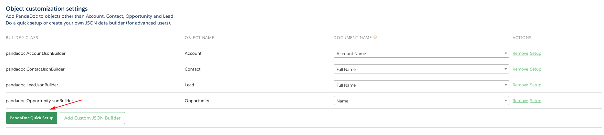
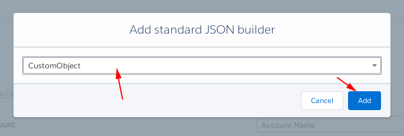
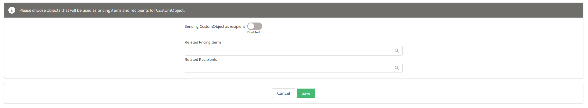
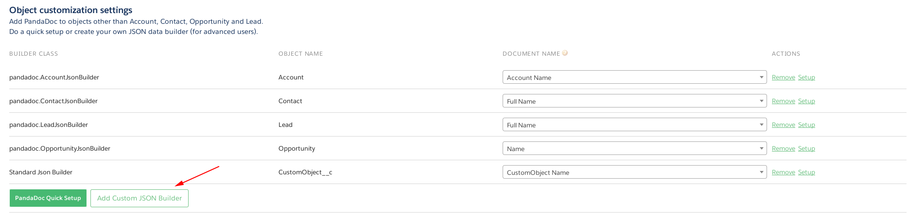
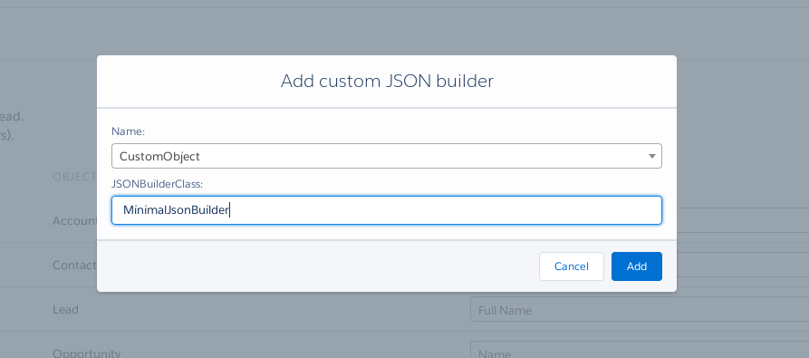
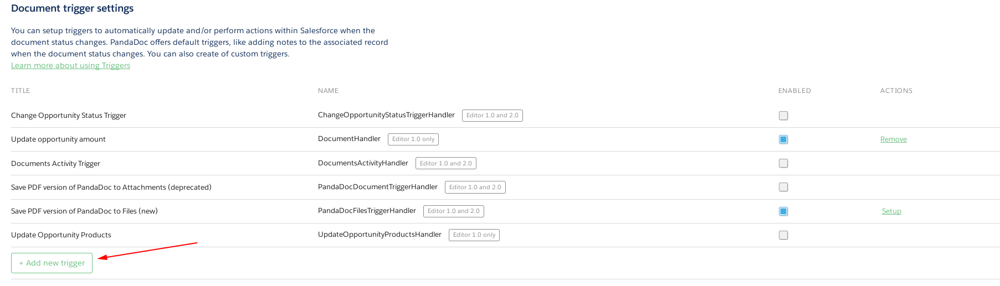
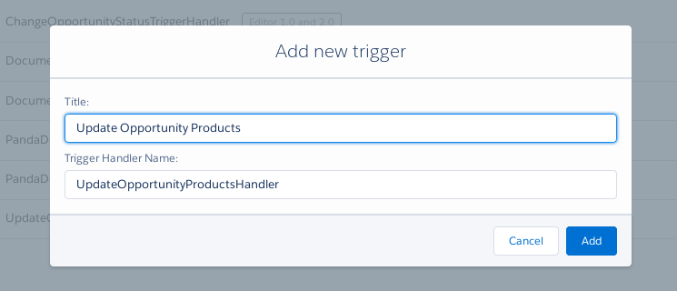

# Code examples for PandaDoc Salesforce package extensions

This repository contains code examples and available API methods for PandaDoc extension for Salesforce CRM.
Our [AppExchange page](https://appexchange.salesforce.com/appxListingDetail?listingId=a0N3A00000DvMrEUAV)

Sometimes standard functionality of PandaDoc package is not enough.
For this reason our package provides API for implementing additional customizations for specific business cases.

Currently PandaDoc package provides two different types of API for package extensions.

1. ## JSON builders.
    JSON builders are used for passing data from Salesforce to PandaDoc document. It is a class which implements `pandadoc.JsonBuilder` interface. JSON builder can pass this data into PandaDoc:
    - tokens
    - document name
    - pricing items
    - recipients
    - metadata

2. ## Trigger handlers
    Every time a document's state changes PandaDoc sends a new document payload in JSON format into SFDC. Our package saves this data into [pandadoc__PandaDocDocument__c](docs/pandadoc__PandaDocDocument__c.md) object. Our API provides a simplified solution for handling these changes via SF triggers. Currently we send the following events to SFDC side:
    - `document_state_changed`: document status was changed or new document created. You get this event every time a document is sent\paid\approved\etc
    - `recipient_completed`: some recipients filled all required input fields
    - `document_deleted`: document was deleted
    - `document_updated`: sent or completed document was edited (moved to draft). New document version was generated.

# How to use these examples

All examples are in the `examples` folder. This is a SFDX project, [here you can find more info on how to work with SFDX](https://developer.salesforce.com/tools/sfdxcli). We highly recommend to upload this source code into a test or sandbox organization and run tests there. By default, [this source code already has installedPackage](examples/force-app/main/default/installedPackages/pandadoc.installedPackage-meta.xml), you do not need to install our package manually. It already has the configured simple custom object.

# StandardJsonBuilder

PandaDoc package provides StandardJsonBuilder. This builder can be configured to provide:
- set of tokens
- related recipients
- related pricing items
- document name
- send object itself as recipient(useful for objects like Lead, Contact or Account)

This builder can be configured via UI. The provided functionality should be enough to cover your business requirements. You do not need to create new Apex classes. Use `PandaDoc Quick Setup` button on `PandaDoc Setup` page to use already provided functionality.

# Custom JSON builder examples

In `examples` folder you can find the source code for JSON builders:
- [MinimalJsonBuilder](examples/force-app/main/default/classes/MinimalJsonBuilder.cls): this is a minimal required JSON Builder. It respects document name and tokens list which was configured via `PandaDoc Setup page`. **Recipients and pricing items will always be empty**.

        NOTE: Make sure that class has `global` access level.

- [CustomRecipients](examples/force-app/main/default/classes/CustomRecipients.cls): This example adds two recipients to the document. One is generated via related contact, another is a hardcoded recipient.

    - Method `getObjectContact` shows how to generate recipients from SObject. This method respects the `Recipient Mapping` setting from `PandaDoc Setup`.

            NOTE: To avoid `System.SObjectException: SObject row was retrieved via SOQL without querying the requested field` error please re-select provided sobject for every required operation like "form recipients" or "form pricing items"

    - Method `getPredefinedRecipient` shows how to generate recipients for any kind of data. This method might not work with recipient mapping from `PandaDoc Setup` page but allows to generate recipients almost from everything.

    Additional information about `Recipient` object [here](docs/Recipient.md)

- [CustomPricingItems](examples/force-app/main/default/classes/CustomPricingItems.cls): Similar to `CustomRecipients` shows how to add pricing items into document.

        NOTE: By default the package does not have pricing item mapping for Product2 object.
        NOTE: Currently we are not providing any public API to use sorting settings from Pricing Items mapping page. This is an experimental feature and public access for third party customizations will be added later.

    Additional information about `Item` object [here](docs/Item.md)

- [ExtraTokens](examples/force-app/main/default/classes/ExtraTokens.cls): This builder adds additional tokens to a document. The document will have tokens which were selected in the `PandaDoc Setup` page.

- [CustomRelation](examples/force-app/main/default/classes/CustomRelation.cls): This builder shows how to link document to additional object. Every new document be shown on CustomObject and on related contact. See: [SourceNode](docs/SourceNode.md)

- [DefaultBehaviorBuilder](examples/force-app/main/default/classes/DefaultBehaviorBuilder.cls): This example shows how to add default behavior for recipients and pricing items from default builder. You can as use default value as modify them according to business requirements.

        Please note. Currently not possible to add Setup button for custom builders. As workaround possible to add builder via the PandaDoc Quick Setup button. Configure builder and after that just add your custom builder without removing Standard Builder. All your setting be saved except that your class be used insted of default class.

To use custom JSON builder class, upload examples to target organization with installed PandaDoc package. After that, click on the `Add Custom JSON Builder` button and in the showed popup window, please enter the class name for the selected SObject.

# VisualForce inline page for classic UI
We highly recommend using Lightning Component for adding PandaDoc to SObject pages. [Here you can find how to set up PandaDoc in Salesforce Lightning](https://support.pandadoc.com/hc/en-us/articles/360019828554-Salesforce-Lightning-Standard-setup-).

If you’re using Salesforce Classic, you need to create a new Visualforce page for every object in which you want to use PandaDoc. Contact, Lead, Account and Opportunity are already include VF pages in package.

[Here you can find more info about configuring PandaDoc for the Salesforce Classic UI](https://support.pandadoc.com/hc/en-us/articles/360007816454-Salesforce-Classic-Add-PandaDoc-to-custom-objects).

# Trigger handler example

[DocumentHandler](examples/force-app/main/default/classes/DocumentHandler.cls) provides an example of trigger handler. This simple handler updates OpportunityLineItem quantity and unit price from PandaDoc document. This handler still can not be executed without a properly created trigger for `pandadoc__PandaDocDocument__c` object. Please look at [PandaDocDocumentTrigger](examples/force-app/main/default/triggers/PandaDocDocumentTrigger.trigger). Please look at `pandadoc.TriggerTemplate.TriggerManager` object. This object provides possibility to work with `Document trigger settings` from the `PandaDoc setup` page.

For adding a custom Trigger to PandaDoc upload all source code into organization and click on `Add new trigger` button.

On PopUp window enter title for new handler(any human readable text) and an internal trigger name. This name will be a unique identificator for this trigger and this name should be used with `pandadoc.TriggerManager.isTriggerEnabled` method.

If everything has been configured correctly you will have a possibility to enable\disable trigger handlers right from the PandaDoc setup page.

# Additional API reference
- [Item](docs/Item.md): wrapper for document pricing item
- [Recipient](docs/Recipient.md): wrapper for document recipient
- [JSONBuilder](docs/JSONBuilder.md): base class for custom JSON builders
- [pandadoc__PandaDocDocument__c](docs/pandadoc__PandaDocDocument__c.md): Database object which represents PandaDoc document
- [DocumentWrapper](docs/DocumentWrapper.md): wrapper for document payload. Used in triggers
- [TriggerTemplate](docs/TriggerTemplate.md): util classes for implementing custom trigger handlers
- [TriggerManager](docs/TriggerManager.md): API for trigger settings
- [SourceNode](docs/SourceNode.md): Represents an entity which linked with document