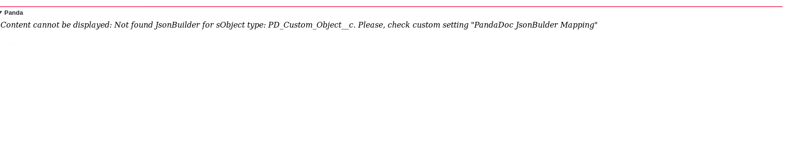
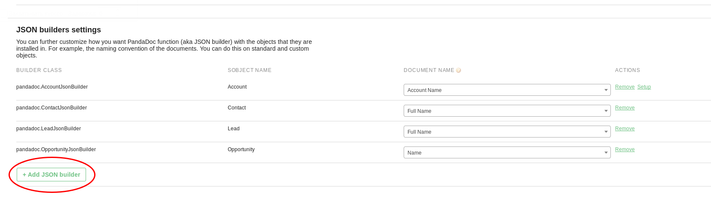
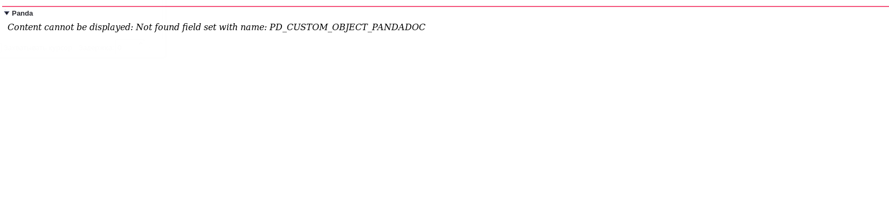
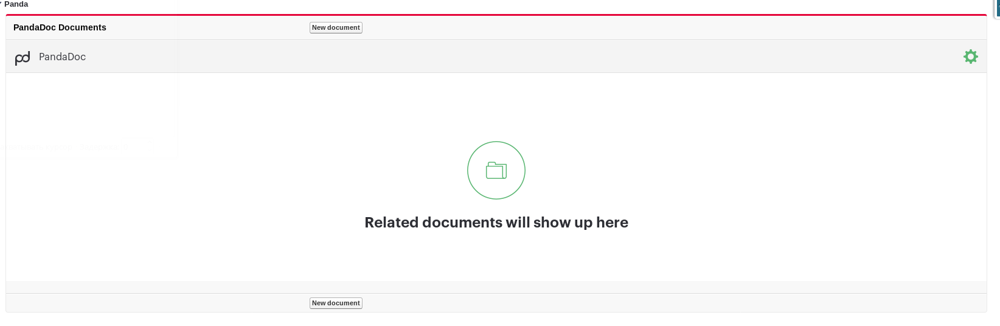
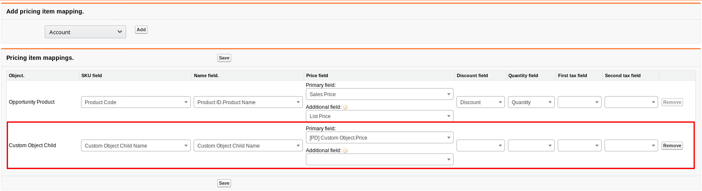
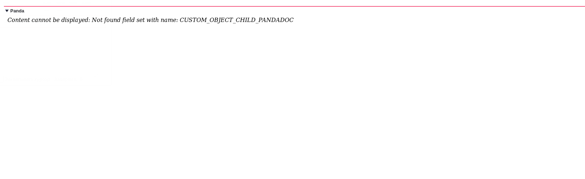

# Salesforce JSON Builder example for PandaDoc.
By default PandaDoc package supports only Account, Contact, Lead and Opportunity objects. This repository contains example code for adding additional objects to Salesforce-PandaDoc integration.
 
**If you want to use additional objects with PandaDoc this tutorial can help you with that.**

## Step1 Minimal setup
&nbsp;&nbsp;&nbsp;&nbsp;All source code examples for this step stores in branch **first-step**

&nbsp;&nbsp;&nbsp;&nbsp;At first you should create a new VisualForce page. This page will be added to your Object layout later. Go to [CustomObjectPandaDoc.page](//github.com/PandaDoc/pandadoc-sfdc-examples/blob/master/src/pages/CustomObjectPandaDoc.page) file. Copy the source of this page and paste it to your new page. Now find in first line: `standardController="PD_Custom_Object__c"` and replace PD_Custom_Object__c to your object API name. Save your new page **and add it to object layout**.

&nbsp;&nbsp;&nbsp;&nbsp;Now you can open object and see this:

&nbsp;&nbsp;&nbsp;&nbsp;Need to create JSON builder which will convert your SObject to acceptable data format for PandaDoc. Go to [Step1: CustomObjectJsonBuilder.cls](//github.com/PandaDoc/pandadoc-sfdc-examples/blob/first-step/src/classes/CustomObjectJsonBuilder.cls) file. If you opened CustomObjectJsonBuilder in **first-step** branch then now you see minimal example for JSON builder.  Copy the source code of this class and save it to your new. Don't forget to change class name at first line and constructor name. Also in line `super(PD_Custom_Object__c.getSObjectType(), null, null);` you should change PD_Custom_Object__c to your SObject API name.

&nbsp;&nbsp;&nbsp;&nbsp;&nbsp;&nbsp;&nbsp;&nbsp;After that go to PandaDoc Setup page in your Salesforce organization. Here you need to add your new JSON builder and link it to SObject. For that click on `Add JSON builder` button.

&nbsp;&nbsp;&nbsp;&nbsp;Now you can open object and see this:

&nbsp;&nbsp;&nbsp;&nbsp;According to error text create fieldset with name which was mentioned in error. This field set used for sending Salesforce fields to PandaDoc as tokens.

&nbsp;&nbsp;&nbsp;&nbsp;That's it! Now you have minimal setup for custom object. Currently JSON builder does not forms recipients or pricing items. How to do this you can see in next steps.

## Step2 Adding Pricing Items
&nbsp;&nbsp;&nbsp;&nbsp;&nbsp;&nbsp;&nbsp;&nbsp;All source code examples for this step stores in branch **second-step**

&nbsp;&nbsp;&nbsp;&nbsp;&nbsp;&nbsp;&nbsp;&nbsp;At first we need to create a mapping. Go to `PandaDoc configure PricingItems` tab.  And here add mapping for SObject which should be used as PricingItem. For example if we want to send **Opportunilty Products** from **Opportunity** to PandaDoc as Pricing Items then we need to create mapping for **Opportunilty Products** but not for *Opportunity* itself.

&nbsp;&nbsp;&nbsp;&nbsp;&nbsp;&nbsp;&nbsp;&nbsp;Also in JSON builder we need to implement method `pandadoc.Item[] getItems(sObject record)`. Here is example for that: [Step2: CustomObjectJsonBuilder.cls](//github.com/PandaDoc/pandadoc-sfdc-examples/blob/second-step/src/classes/CustomObjectJsonBuilder.cls#L9-L31) . Just adapt this example to your data model. Also you can use alternate version for this: [Step2.1: CustomObjectJsonBuilder.cls](//github.com/PandaDoc/pandadoc-sfdc-examples/blob/second-step-alternate/src/classes/CustomObjectJsonBuilder.cls#L4-L32)

&nbsp;&nbsp;&nbsp;&nbsp;&nbsp;&nbsp;&nbsp;&nbsp;Now if you open your object you see error:

You should create a field set for Pricing Item objects just like you did it for parent sobject previously. This field set used for sending custom fields for Pricing Items,

&nbsp;&nbsp;&nbsp;&nbsp;Now your Pricing Items should works!

## Step3 Adding Recipients
&nbsp;&nbsp;&nbsp;&nbsp;&nbsp;&nbsp;&nbsp;&nbsp;Sending Recipient is very similar to previous step with Pricing Item. See example: [Step3: CustomObjectJsonBuilder.cls](//github.com/PandaDoc/pandadoc-sfdc-examples/blob/third-step/src/classes/CustomObjectJsonBuilder.cls#L33-L55) . Or alternate version: [Step3.1: CustomObjectJsonBuilder.cls](//github.com/PandaDoc/pandadoc-sfdc-examples/blob/third-step-alternate/src/classes/CustomObjectJsonBuilder.cls) . 

&nbsp;&nbsp;&nbsp;&nbsp;&nbsp;&nbsp;&nbsp;&nbsp;You also need to create Recipient mapping in the `PandaDoc Configure Recipients` tab. **But for Recipients no need to create any field sets because they are not supports custom fields.**
